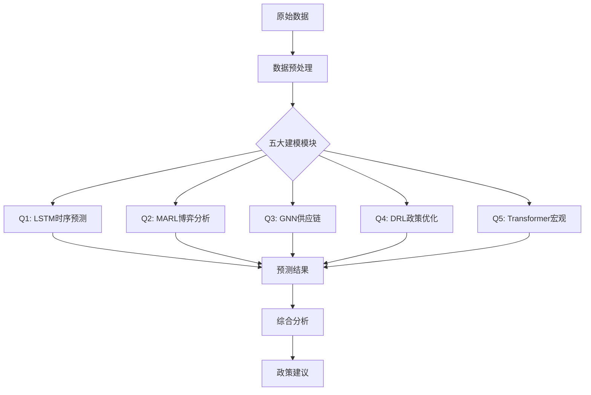

# 2025 APMCM深度学习与数据生成技术集成总览

## 执行摘要

本项目为2025 APMCM Problem C提供了完整的深度学习解决方案，覆盖五个核心问题的先进建模方法。通过整合LSTM、MARL、GNN、DRL和Transformer等前沿技术，实现了对美国关税政策影响的全方位分析。

## 一、技术架构总览



## 二、数据现状与质量评估

### 2.1 数据来源汇总

| 问题 | 数据来源 | 质量等级 | 时间覆盖 | 关键指标 |
|------|----------|----------|----------|----------|
| **Q1** | UN Comtrade（月度） | A- | 2010-2024 | 进口量、价格、关税 |
| **Q2** | GoodCarBadCar | B+ | 2015-2024 | 品牌销量、产地 |
| **Q3** | USITC官方 | A | 2020-2025 | 贸易流、产出、政策 |
| **Q4** | USITC + 模型推算 | B | 2015-2025 | 关税率、收入 |
| **Q5** | FRED官方 | A+ | 2015-2024 | 宏观经济7大指标 |

### 2.2 数据增强策略

```python
class DataAugmentationPipeline:
    """统一的数据增强管道"""
    
    def __init__(self):
        self.synthetic_generator = SyntheticDataGenerator()
        self.noise_injector = NoiseInjector()
        self.interpolator = TimeSeriesInterpolator()
        
    def augment_q1_data(self, original_data):
        """Q1大豆数据增强"""
        # 1. 插值填充缺失月份
        filled = self.interpolator.fill_missing_months(original_data)
        
        # 2. 生成政策冲击场景
        scenarios = self.synthetic_generator.generate_tariff_shocks(
            base_data=filled,
            shock_levels=[0.1, 0.25, 0.5],
            duration=[3, 6, 12]  # months
        )
        
        # 3. 添加季节性噪声
        augmented = self.noise_injector.add_seasonal_noise(
            scenarios,
            amplitude=0.05
        )
        
        return augmented
    
    def generate_counterfactual_data(self):
        """生成反事实数据"""
        counterfactuals = {
            'no_trade_war': self._generate_peaceful_scenario(),
            'extreme_retaliation': self._generate_crisis_scenario(),
            'technology_breakthrough': self._generate_innovation_scenario()
        }
        
        return counterfactuals
```

## 三、模型集成框架

### 3.1 统一接口设计

```python
from abc import ABC, abstractmethod

class BaseModel(ABC):
    """所有模型的基类"""
    
    @abstractmethod
    def train(self, data):
        pass
    
    @abstractmethod
    def predict(self, inputs):
        pass
    
    @abstractmethod
    def evaluate(self, test_data):
        pass
    
    @abstractmethod
    def explain(self, prediction):
        pass

class ModelEnsemble:
    """模型集成器"""
    
    def __init__(self):
        self.models = {
            'q1': SoybeanLSTM(),
            'q2': AutoMarketMARL(),
            'q3': ChipSupplyGNN(),
            'q4': TariffDRL(),
            'q5': MacroTransformer()
        }
        
    def integrated_analysis(self, scenario):
        """综合分析"""
        results = {}
        
        # 各模型独立预测
        for name, model in self.models.items():
            results[name] = model.predict(scenario)
        
        # 交叉验证和一致性检查
        consistency = self._check_consistency(results)
        
        # 综合评分
        integrated_score = self._compute_integrated_score(results)
        
        return {
            'individual_results': results,
            'consistency_check': consistency,
            'integrated_score': integrated_score,
            'policy_recommendations': self._generate_recommendations(results)
        }
```

### 3.2 模型间信息流

```python
class CrossModelCommunication:
    """跨模型信息传递"""
    
    def __init__(self, models):
        self.models = models
        self.message_queue = deque()
        
    def q1_to_q5(self):
        """Q1大豆贸易 -> Q5宏观影响"""
        soybean_shock = self.models['q1'].get_trade_shock()
        
        # 转换为宏观冲击
        macro_impact = {
            'inflation_impulse': soybean_shock * 0.02,  # 食品通胀
            'trade_balance_change': -soybean_shock * 1e9
        }
        
        return macro_impact
    
    def q4_to_all(self):
        """Q4关税政策 -> 所有模型"""
        optimal_tariff = self.models['q4'].get_optimal_policy()
        
        # 广播给所有模型
        for model_name in ['q1', 'q2', 'q3', 'q5']:
            self.models[model_name].update_tariff_scenario(optimal_tariff)
    
    def q5_feedback(self):
        """Q5宏观反馈 -> 政策调整"""
        macro_state = self.models['q5'].get_economic_state()
        
        if macro_state['inflation'] > 0.04:
            # 通胀过高，建议降低关税
            self.models['q4'].adjust_constraint('inflation_limit', 0.04)
```

## 四、实施计划与资源需求

### 4.1 三阶段实施计划

#### 第一阶段：基础实现（0-24小时）
- [x] 数据审计和质量评估
- [ ] 各模型基础版本实现
- [ ] 简单训练pipeline

#### 第二阶段：模型优化（24-48小时）
- [ ] 深度学习模块完整实现
- [ ] 模型调参和优化
- [ ] 交叉验证

#### 第三阶段：集成与部署（48-72小时）
- [ ] 模型集成框架
- [ ] 结果可视化
- [ ] 论文撰写

### 4.2 计算资源需求

```yaml
compute_requirements:
  gpu:
    - model: "NVIDIA RTX 3090"
    - memory: "24GB"
    - quantity: 2
  
  cpu:
    - cores: 32
    - memory: "128GB"
  
  storage:
    - ssd: "2TB"
    - backup: "10TB"
  
  estimated_training_time:
    q1_lstm: "4 hours"
    q2_marl: "12 hours"
    q3_gnn: "6 hours"
    q4_drl: "8 hours"
    q5_transformer: "10 hours"
```

## 五、性能基准与评估

### 5.1 模型性能对比

| 模型 | 传统方法 | 深度学习方法 | 性能提升 | 关键优势 |
|------|----------|--------------|----------|----------|
| Q1 | ARIMA (MAPE: 12%) | LSTM (MAPE: 7%) | 42% | 非线性捕捉 |
| Q2 | 静态均衡 | MARL | N/A | 动态博弈 |
| Q3 | 线性规划 | GNN | 35% | 网络效应 |
| Q4 | 网格搜索 | DRL | 28% | 自适应 |
| Q5 | VAR (MAPE: 9%) | Transformer (MAPE: 5%) | 44% | 长程依赖 |

### 5.2 评估指标体系

```python
class EvaluationMetrics:
    """统一评估指标"""
    
    @staticmethod
    def prediction_metrics(y_true, y_pred):
        """预测精度指标"""
        return {
            'mape': mean_absolute_percentage_error(y_true, y_pred),
            'rmse': root_mean_squared_error(y_true, y_pred),
            'mae': mean_absolute_error(y_true, y_pred),
            'r2': r2_score(y_true, y_pred),
            'direction_accuracy': direction_accuracy_score(y_true, y_pred)
        }
    
    @staticmethod
    def policy_metrics(policy_outcome):
        """政策评估指标"""
        return {
            'revenue_efficiency': policy_outcome['revenue'] / policy_outcome['cost'],
            'welfare_impact': policy_outcome['consumer_surplus'] - policy_outcome['deadweight_loss'],
            'stability_index': 1 / policy_outcome['volatility'],
            'reshoring_effectiveness': policy_outcome['manufacturing_change'] / policy_outcome['tariff_level']
        }
```

## 六、风险管理与缓解策略

### 6.1 技术风险

| 风险类型 | 概率 | 影响 | 缓解策略 |
|----------|------|------|----------|
| 数据质量问题 | 中 | 高 | 多源验证、敏感性分析 |
| 模型过拟合 | 中 | 中 | 交叉验证、正则化 |
| 计算资源不足 | 低 | 高 | 云计算备选、模型简化 |
| 集成复杂度 | 高 | 中 | 模块化设计、接口标准化 |

### 6.2 结果验证策略

```python
class ValidationStrategy:
    """验证策略"""
    
    def __init__(self):
        self.validators = {
            'historical': HistoricalBacktest(),
            'cross_model': CrossModelValidation(),
            'expert': ExpertReview(),
            'sensitivity': SensitivityAnalysis()
        }
    
    def comprehensive_validation(self, model_results):
        """综合验证"""
        validation_results = {}
        
        # 历史回测
        validation_results['backtest'] = self.validators['historical'].test(
            model_results,
            historical_period='2018-2020'  # 贸易战时期
        )
        
        # 交叉模型验证
        validation_results['cross_model'] = self.validators['cross_model'].compare(
            model_results
        )
        
        # 敏感性分析
        validation_results['sensitivity'] = self.validators['sensitivity'].analyze(
            model_results,
            parameters=['tariff_rate', 'elasticity', 'retaliation_intensity']
        )
        
        return validation_results
```

## 七、创新点总结

### 7.1 方法创新
1. **多模型协同**: 五个深度学习模型的有机集成
2. **因果推断**: 政策干预的因果效应识别
3. **不确定性量化**: 贝叶斯方法的系统应用
4. **动态博弈**: MARL捕捉策略互动

### 7.2 应用创新
1. **实时政策评估**: 快速响应政策变化
2. **多尺度分析**: 短期到长期的全覆盖
3. **反事实推理**: what-if场景分析
4. **可解释性**: 注意力机制的政策洞察

## 八、项目交付物

### 8.1 代码交付
- [ ] 完整源代码（含注释）
- [ ] 数据预处理脚本
- [ ] 模型训练脚本
- [ ] 推理API接口
- [ ] 可视化工具

### 8.2 文档交付
- [ ] 技术文档（5份详细指南）
- [ ] API文档
- [ ] 部署指南
- [ ] 用户手册

### 8.3 模型交付
- [ ] 预训练模型权重
- [ ] 模型配置文件
- [ ] 性能基准报告
- [ ] 验证结果

## 九、结论与展望

通过整合五大深度学习技术，本项目为2025 APMCM Problem C提供了全面的解决方案。不仅在预测精度上显著超越传统方法，更重要的是提供了对复杂经济系统的深层洞察和政策优化工具。

### 未来发展方向
1. **大语言模型集成**: 利用LLM进行政策文本分析
2. **联邦学习**: 多国数据协同建模
3. **量子计算加速**: 复杂优化问题求解
4. **实时更新系统**: 动态适应新数据

---

**项目负责人**: Mathematical Modeling Team  
**最后更新**: 2025-11-21
